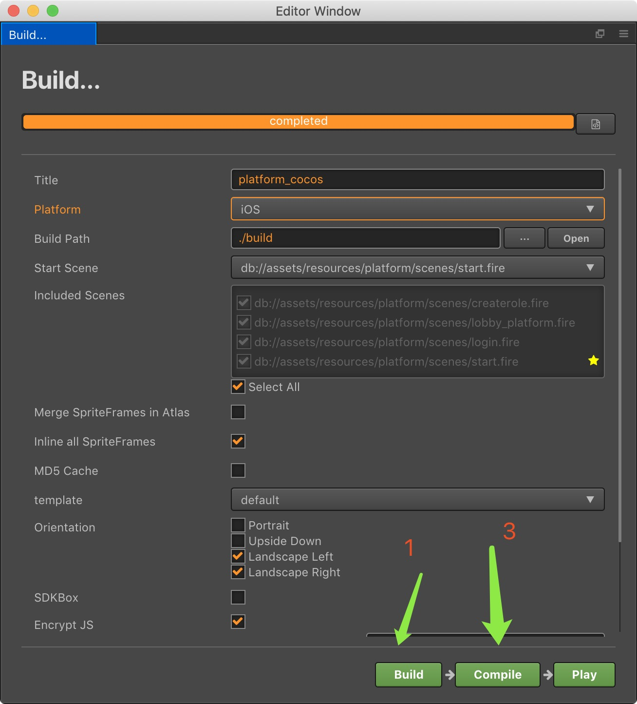

<h1 align=center>热更新打包流程</h1>

<u>Cocos Creator项目发布设置</u>

iOS App发布流程

---
- 第一步、打Cocos Creator项目发布设置
- 第二步、Platform（平台）选择iOS
- 第三步、template（模板) 选择default （幼麟棋牌对Cococs源码做了修改，必须选择default 否则可能会影响支付相关功能)
- 第四步、Build(构建) 图中绿箭头1所示
- 第五步、修改 build_hot中的版本号（一般情况下是自增)
- 第六步、执行build_hot.sh
- 第七步、打开Xcode项目，进行编译和出包

Android App发布流程

---
- 第一步、打开Cocos Creator项目发布设置
- 第二步、Platform（平台）选择iOS
- 第三步、template（模板) 选择default （幼麟棋牌对Cococs源码做了修改，必须选择default 否则可能会影响支付相关功能) 
- 第四步、设置好签名和包名 （签名和包名会影响微信登录)
- 第五步、Build(构建) 图中绿箭头1所示
- 第六步、修改 build_hot中的版本号（一般情况下是自增)
- 第七步、执行build_hot.sh （如果使用Windows构建Android,可使用build_hot.bat）
- 第八步、Compile（编译），进行编译和出包
- 第九步、proj.android目录下面执行 ant release

热更新包发布流程
---
- 第一步、打开Cocos Creator项目发布设置
- 第二步、Platform（平台）选择iOS/Android/Windows任何一个原生平台
- 第三步、Build(构建)
- 第四步、修改 build_hot中的版本号（一般情况下是自增)
- 第五步、执行build_hot.sh 或者 build_hot.bat

[^_^]:

    注1：建议使用本目录下的 hot_update_tool进行打包，才能按照上面的步骤来。
    注2：本目录下打包的version.manifest与project.manifest没有携带热更新链接，请查看 引用1：幼麟棋牌版本更新机制

引用1：[幼麟棋牌版本更新机制](幼麟棋牌版本更新机制.md)